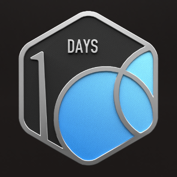
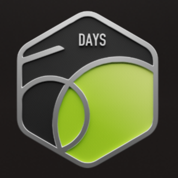
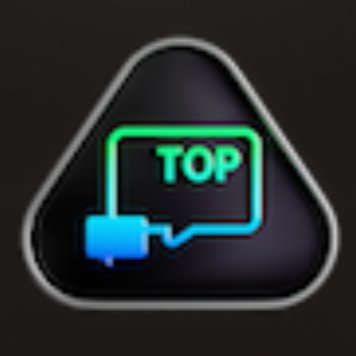
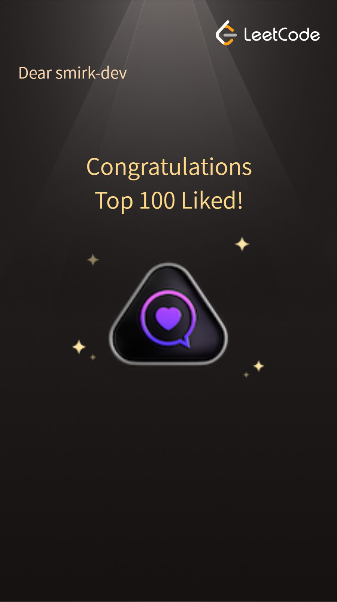
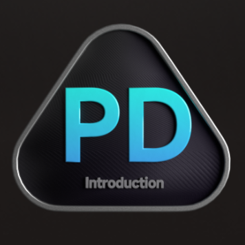
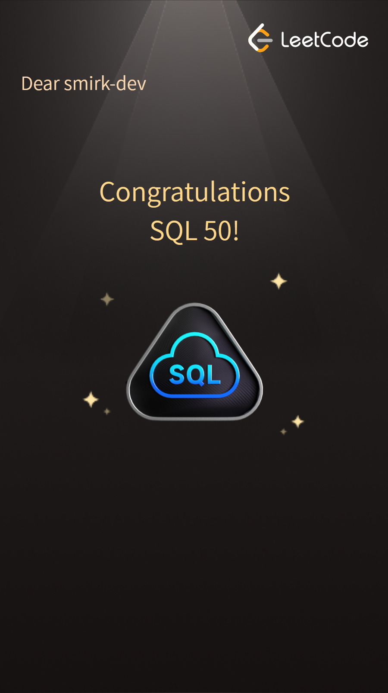
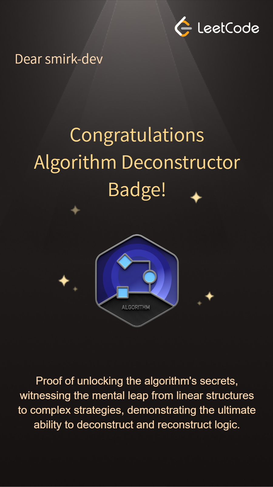
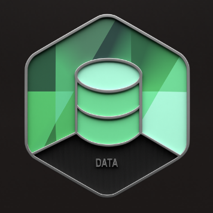
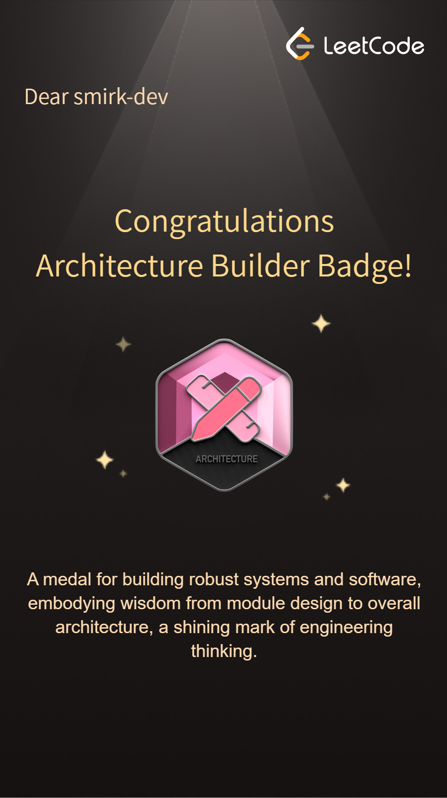

  

  <table>
    <tr>
      <td align="center">
        
      </td>
      <td align="center">
        
      </td>
    </tr>
  </table>

  

  

## 🎨 Featured Projects

<table>
  <tr>
    <td align="center" width="50%">
      
    </td>
    <td align="center" width="50%">
      
    </td>
  </tr>
  <tr>
    <td align="center" width="50%">
      
    </td>
    <td align="center" width="50%">
      
    </td>
  </tr>
  <tr>
    <td align="center" width="50%">
      
    </td>
    <td align="center" width="50%">
      
    </td>
  </tr>
</table>

---

## 🏆 GitHub Achievements

 
    

    

## 🎃 Hacktoberfest Achievements

  
    
  
    
  
  

## 🔥 LeetCode Badges

  <table style="border-collapse: collapse; border-spacing: 0;">
    <tr>
      <td align="center" style="padding: 5px;">
        
      </td>
      <td align="center" style="padding: 5px;">
        
      </td>
      <td align="center" style="padding: 5px;">
        
      </td>
      <td align="center" style="padding: 5px;">
        
      </td>
      <td align="center" style="padding: 5px;">
        
      </td>
    </tr>
    <tr>
      <td align="center" style="padding: 5px;">
        
      </td>
      <td align="center" style="padding: 5px;">
        
      </td>
      <td align="center" style="padding: 5px;">
        
      </td>
      <td align="center" style="padding: 5px;">
        
      </td>
      <td align="center" style="padding: 5px;">
        
      </td>
    </tr>
    <tr>
      <td align="center" style="padding: 5px;">
        
      </td>
    </tr>
  </table>

   

        

  

## 🌐 Connect With Me

  <table>
    <tr>
      <td align="center">
        
      </td>
      <td align="center">
        
      </td>
      <td align="center">
        
      </td>
    </tr>
  </table>

---

## 🛠️ Technology Stack

  <table>
    <tr>
      <td align="center" width="33%">
        <h3>� AI & Machine Learning</h3>
        
          
        
        
         
        
        
      </td>
      <td align="center" width="33%">
        <h3>💻 Programming</h3>
        
          
        
        
      </td>
      <td align="center" width="33%">
        <h3>🌐 Web Development</h3>
        
          
        
        
      </td>
    </tr>
    <tr>
      <td align="center" width="33%">
        <h3>🗄️ Database & Cloud</h3>
        
          
        
        
      </td>
      <td align="center" width="33%">
        <h3>🛠️ Development Tools</h3>
        
          
        
        
      </td>
      <td align="center" width="33%">
        <h3>📱 Specializations</h3>
        

           
           
           
          
        

      </td>
    </tr>
  </table>

---
  
### 💬 Let's Connect and Build Something Amazing Together!

  

