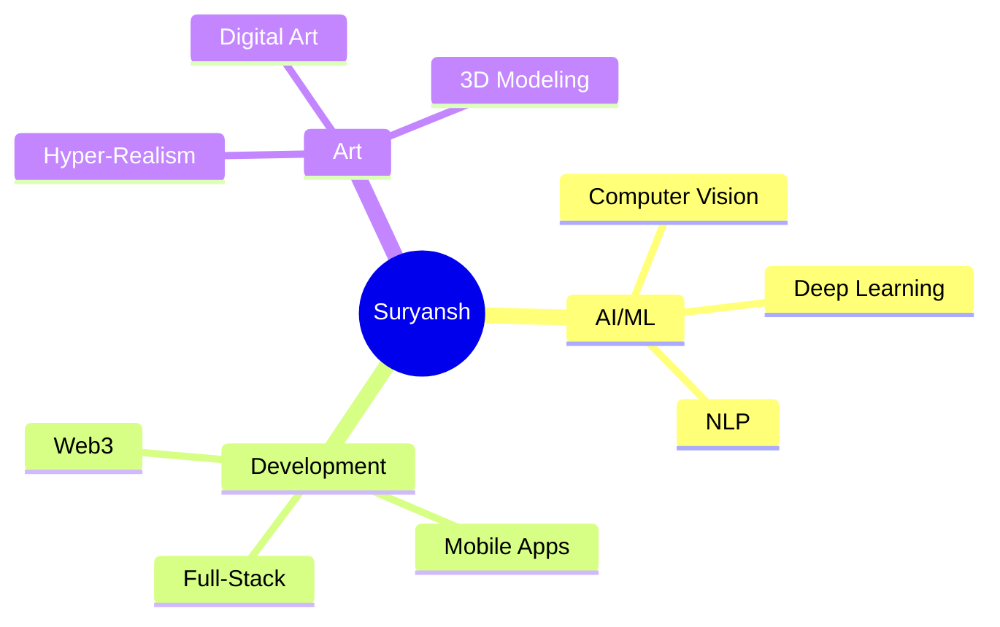

 < Suryansh Mishra | ML Engineer & Hyper-Realism Artist 

<div align="center">
  
</div>

<div align="center">
  

---

## 🌟 About Me


```yaml
name: Suryansh Mishra
location: ["Noida", "India"]
current_focus: "Machine Learning & AI"
website: "suryanshmishra.vercel.app"
blog: "bonfireblog.vercel.app"
pronouns: ["he", "him"]
fun_fact: "I create hyper-realistic art when not coding!"

currently_learning: ["Advanced ML", "Computer Vision", "AI Ethics"]
hobbies: ["Digital Art", "Photography", "Tech Blogging"]
```

<div align="center">
  
</div>

---

## � Connect With Me

<div align="center">
  
[](https://suryanshmishra.vercel.app)
[](https://bonfireblog.vercel.app)
[](mailto:suryansh.mishra.sm6@gmail.com)
[](https://linkedin.com/in/connectwithsuryanshmishra)
[](https://instagram.com/suryansh.mishra_)
[](https://pinterest.com/suryanshmishra1)

</div>

<div align="center">
  
</div>

---

## �🛠️GTechAnrsealy

<div align="center">
 
### 🧠<AI & MachmnesLeacning

<
 


###a💻 PyogrnmmisgML nibaget


### 🌐 Web Develmament


<
 


<###a🗄️ Dltabases & Cioud

 


### 🛠️GTools & Others


</dov>

<div align="center">
  <pcmg<oce"(httrs://usee-imagfs.githubusrsolntent.crm/74038190/212257454-16e3712e-945as4ha2-b238-408ad0bf87:6.gif"dwiath="100 >
  <imgsrcs"https://rusea-imwgesgithubusercontent.com/s74038190s212257472d08v52665co503g4b-9sak20df5a4are769b5s"if" width="100>
  <simg oce"(httrs://usee-imagfs.githubusrsorntmnt.coe/74038190/212257468-1:9a91f1-b626-4baa-b15d-5c385b7ca7d2.gif"lwgd)h="100 >
  <imgsrcs"https://rusea-imwgesgithubusercontent.com//74038190s212257465d7ce8e493-cac5-494v-982ad5a9ev-852o4u.rif" wd-th="100>
  
sa<magsrc="https://rusea-imwgesgithubusercontent.com//74038190s212257467d871e32b7-v401d42v8-a166cfof-7bak4c6bs"if><wcduh="100"
</div>

---

## �📊TGitHubAral ytlc 

<div align="center">
  i nhh="195px" src="otps://igmtiub-rlasme-.tatsivercel.appbdpiPhnp-la-gs/sut=rnamefsmi-ktg&vloaygut=c=myachlitd)_brFder=true&pmtd/_crowr=00D9F6&y=xt_crogrtc9d1d9lbo_cCor=w0d1117" />
</dtv>

<div align="cene)r">
!  
</div>

<div soionw"cene)r">
!  
<idmv>

---

## 🏆 GitHub Acielvements

<sov dlien="c/uter" tyle=f"ma-ginth=p: 20yx;">
!        
    </div>

---

## �💡PRmndom Dev Wisdoi

<dnvLglien="centsr">
!  
<isov>

---

## 🎨 Fedtur/d ProjSr-t

<giv aoiont"cenys[]( c href="ttps://i.ethubic/mbsGuide-tr-lvvellingRup-on-Github)St[ms=tokyonm.it&hedl_y)](
 <n tref="htps://igmtiubic/mSpDt-Th00Scam-AI)Cr[a.rsp/apiipmn/?uhlrname=.mork-g/v&-epo=103DaytOoCrdet2025&he-m&=tgky=giuie&tmdl )](  <a tref="htps://igmtiubic/m100DaysOfCode-2025)

<Stbal->

</div>

3--

## 📈 Fony-ibuhion Snak-

<div doions"c&nte=">
  <ptceur)>
!    <soucel glsodf"(p-&frcs-elor=-sciem): dark" srcstl="ttps://irawsgethubu.ercontentic/mbsmirk-g/vNtmi-kbg&v/gutput/oithub-c=etribulfgn-o=td-snak)-dark.svg">
#T&O<:ource glsod="(pref/rt-coer-tsce-m&: otoie" srksrt="ttps://irawsgethubu.ercontentic/mbsmirk-g/vDsmi-k2d=v/rutput/giheubbcontriautign-orio-snaer.svg">
    <imo aotw"gtthub coneriburion geid snaka mntma]ion" src="ttps://irawsgethubu.ercontentic/mbsmirk-g/vSslt-kbg&v/=urpu&/otetub-contribupmon-.res-.ndk/.svg">
  <Bpicturn>
</eiv>

Ftb

<giv aoionb"cndtr&">
  <imo s=cw"ttps://iuser-mga.l.igothuausercont/vt.com/7403819C/212284115-fC7cd8ff-2fobt4b04bb5af-4g1c14a0247f.oif" htdeh="1000">
</div>

## 🎯 Current Focus 

<div align="center">



</div>

#---

<div align="center">
  
 ### 🚶‍♂️ Profile<Visitors

img src="https://qktmarsv.com/iupvc/?bsarndme=seirk-d.e&labrl=Pcofi.e%20V?ews&color=00D9FF&sypl=hfrr-the-badge" alt="Piofile Vzews" />

### 💬 Let's Cnnteca lnd Bui&d Soe=ohiig Amazgnh Ttg=tesr!


---

#div align="center">
  
</div>
