

  <table>
    <tr>
      <td align="center">
        
      </td>
      <td align="center">
        
      </td>
    </tr>
  </table>

  

  

### 📈 3D Contribution Calendar

  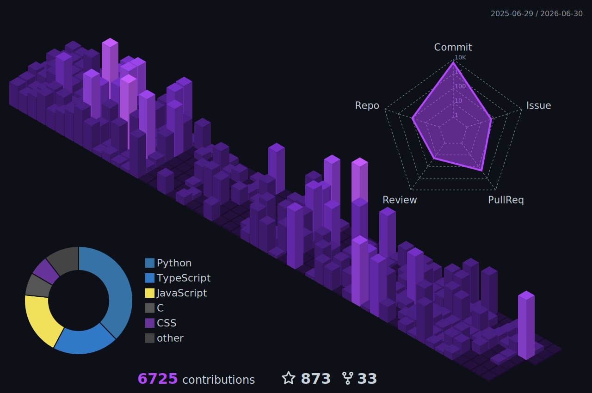

### 🎨 Featured Projects

<table>
  <tr>
    <td align="center" width="50%">
      
    </td>
    <td align="center" width="50%">
      
    </td>
  </tr>
  <tr>
    <td align="center" width="50%">
      
    </td>
    <td align="center" width="50%">
      
    </td>
  </tr>
  <tr>
    <td align="center" width="50%">
      
    </td>
    <td align="center" width="50%">
      
    </td>
  </tr>
</table>

### 🌐 Connect With Me

        <a href="https://suryanshmishra.vercel.app" target="_blank">
          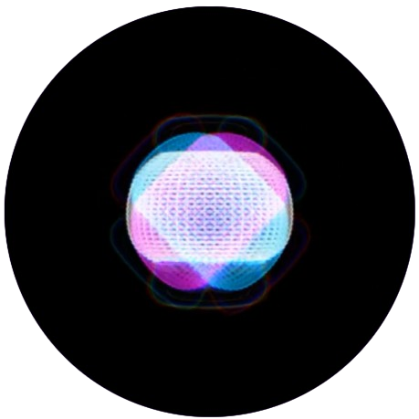
        </a>
        <a href="https://linktr.ee/mishrasuryansh">
          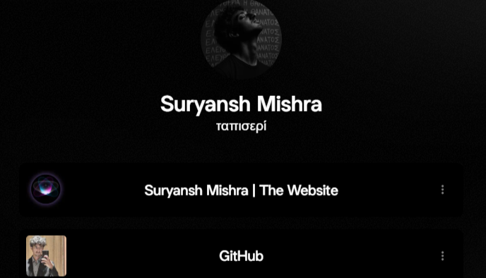
        </a>
        <a href="https://linkedin.com/in/connectwithsuryanshmishra" target="_blank">
          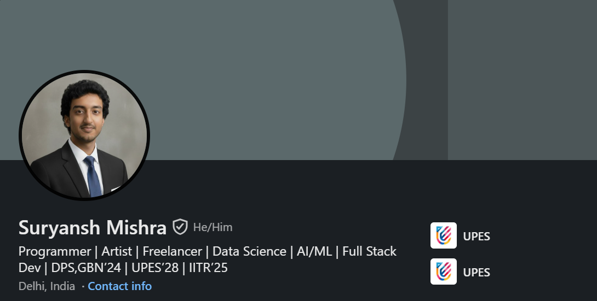
        </a>

### 🛠️ Technology Stack

  <table>
    <tr>
      <td align="center" width="33%">
        <h3>💻 Programming Languages</h3>
        
      </td>
      <td align="center" width="33%">
        <h3>🌐 Frontend & Web</h3>
        
      </td>
      <td align="center" width="33%">
        <h3>⚙️ Backend Development</h3>
        
      </td>
    </tr>
    <tr>
      <td align="center" width="33%">
        <h3>📱 Mobile Development</h3>
        
      </td>
      <td align="center" width="33%">
        <h3>🧠 AI & Machine Learning</h3>
        
         
        
        
        
        
      </td>
      <td align="center" width="33%">
        <h3>🤖 AI Technologies & Agents</h3>
        
        
        
        
         
        
        
        
        
      </td>
    </tr>
    <tr>
      <td align="center" width="33%">
        <h3>🗄️ Databases</h3>
        
      </td>
      <td align="center" width="33%">
        <h3>☁️ DevOps & Cloud</h3>
        
      </td>
      <td align="center" width="33%">
        <h3>🔐 Cybersecurity</h3>
        
         
        
        
        
        
      </td>
    </tr>
    <tr>
      <td align="center" colspan="3">
        <h3>🧰 Development Tools</h3>
        
      </td>
    </tr>
  </table>

### 🎃 Holopin Badges

  
    
  
    
  
  

### 🏆 GitHub Achievements

  

### 🧌  Kaggle Badges

  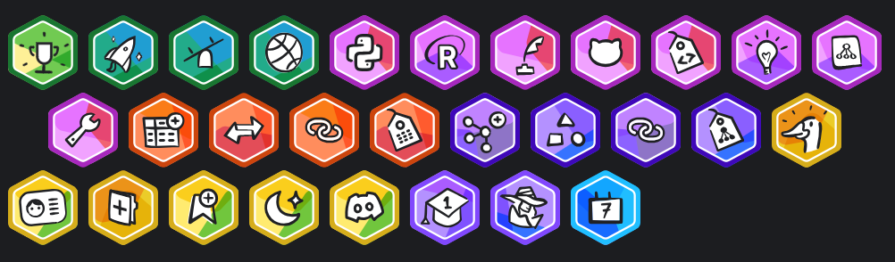

### 🎶  GSSOC Badges

  <table style="border-collapse: collapse; border-spacing: 0;">
    <tr>
      <td align="center" style="padding: 5px;"></td>
      <td align="center" style="padding: 5px;">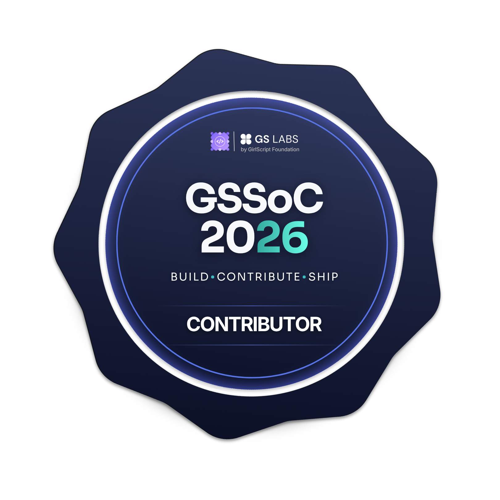</td>
      <td align="center" style="padding: 5px;"></td>
      <td align="center" style="padding: 5px;"></td>
      <td align="center" style="padding: 5px;"></td>
      <td align="center" style="padding: 5px;"></td>
    </tr>
    <tr>
      <td align="center" style="padding: 5px;"></td>
      <td align="center" style="padding: 5px;"></td>
      <td align="center" style="padding: 5px;"></td>
    </tr>
  </table>

### 🔥 LeetCode Badges

  <table style="border-collapse: collapse; border-spacing: 0;">
    <tr>
      <td align="center" style="padding: 5px;">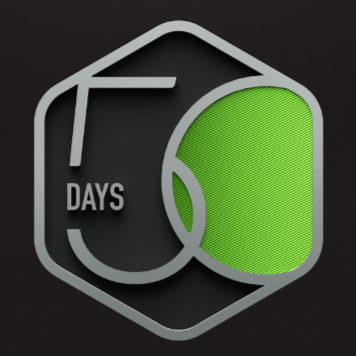</td>
      <td align="center" style="padding: 5px;">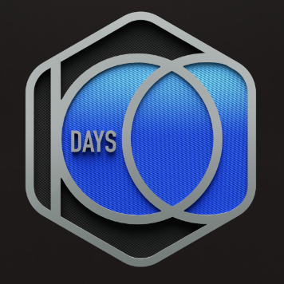</td>
      <td align="center" style="padding: 5px;">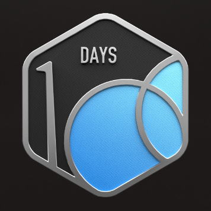</td>
      <td align="center" style="padding: 5px;">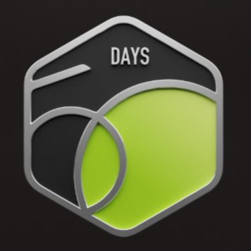</td>
      <td align="center" style="padding: 5px;">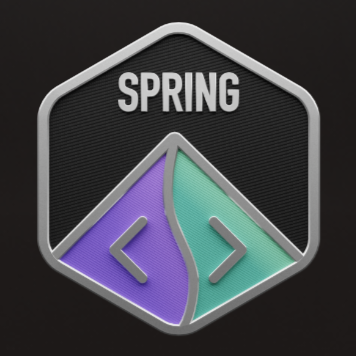</td>
      <td align="center" style="padding: 5px;">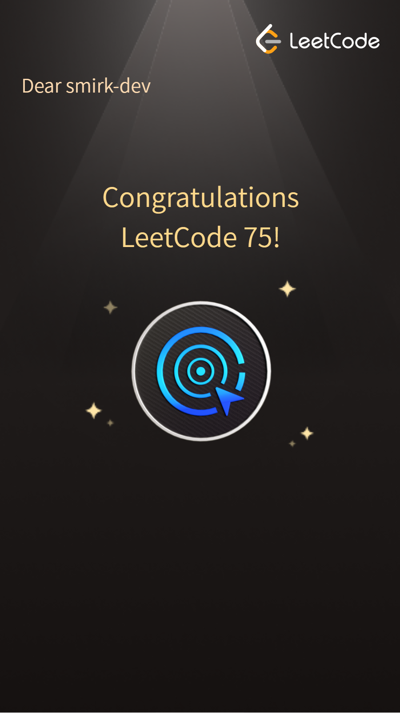</td>
    </tr>
    <tr>
      <td align="center" style="padding: 5px;">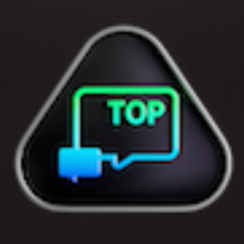</td>
      <td align="center" style="padding: 5px;">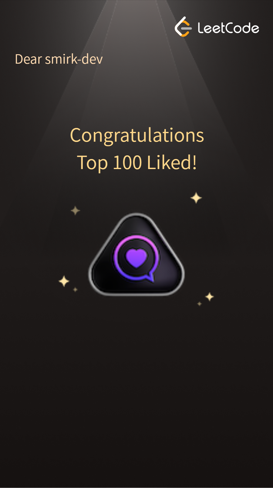</td>
      <td align="center" style="padding: 5px;">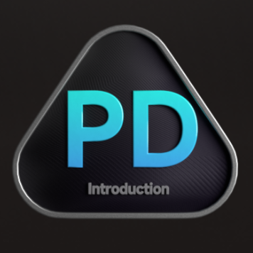</td>
      <td align="center" style="padding: 5px;">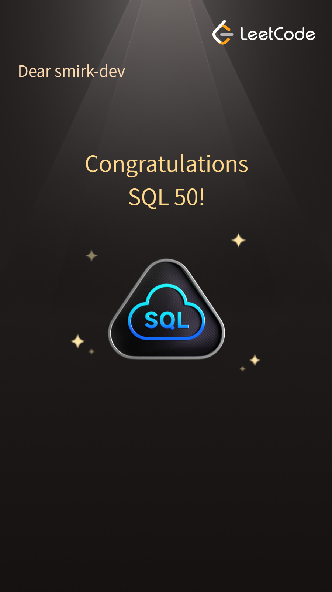</td>
      <td align="center" style="padding: 5px;">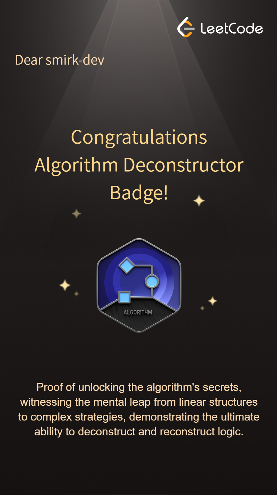</td>
      <td align="center" style="padding: 5px;">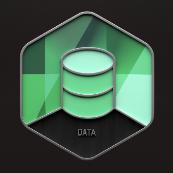</td>
    </tr>
    <tr>
      <td align="center" style="padding: 5px;">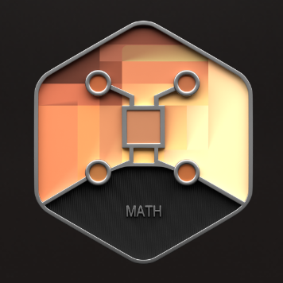</td>
      <td align="center" style="padding: 5px;">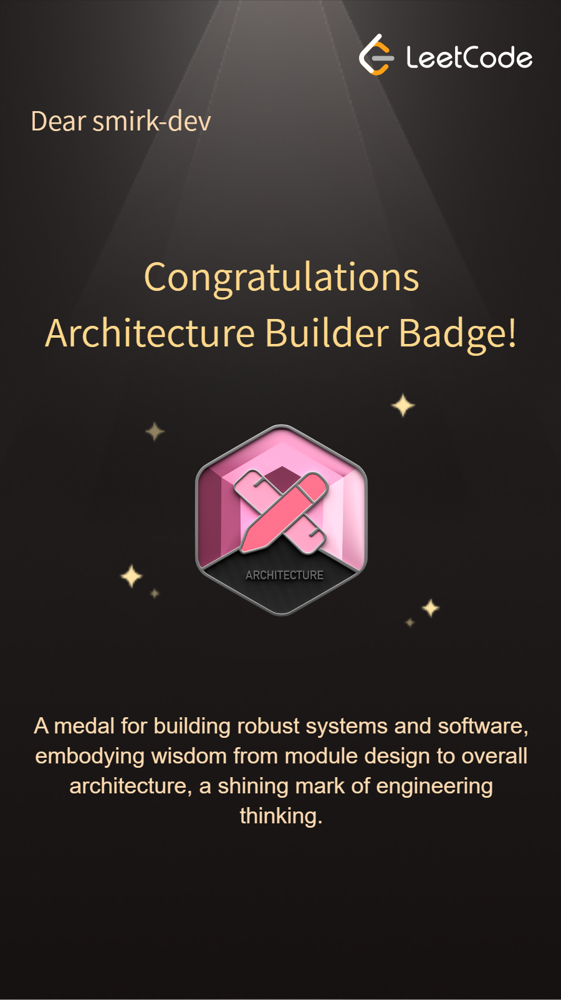</td>
      <td align="center" style="padding: 5px;">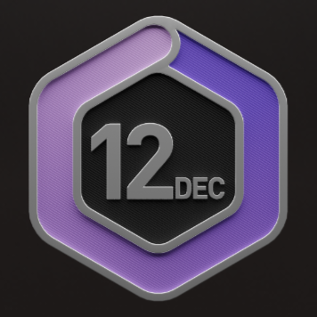</td>
      <td align="center" style="padding: 5px;"></td>
      <td align="center" style="padding: 5px;">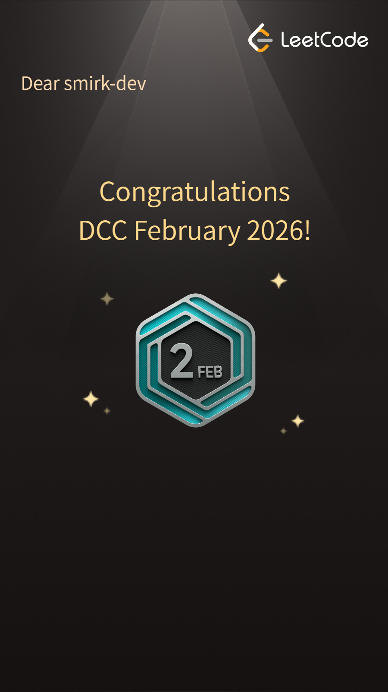</td>
      <td align="center" style="padding: 5px;">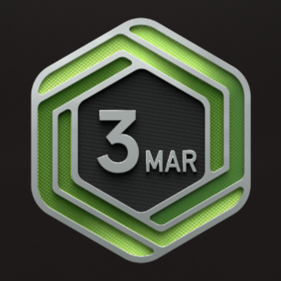</td>
    </tr>
    <tr>
      <td align="center" style="padding: 5px;">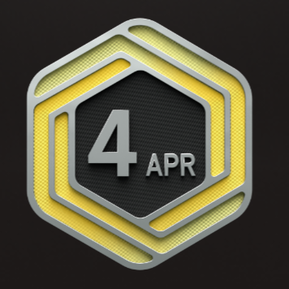</td>
      <td align="center" style="padding: 5px;"></td>
    </tr>
    <tr>
    </tr>
  </table>

   

  

  

  
### 💬 Let's Connect and Build Something Amazing Together!